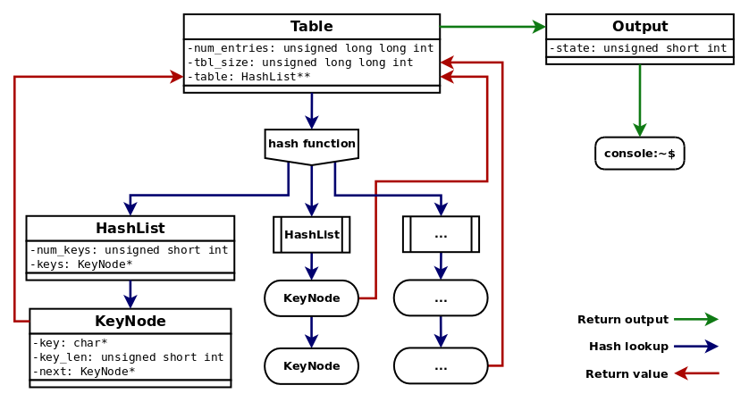
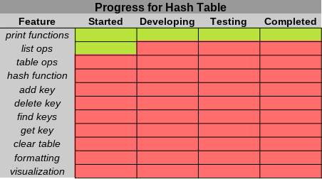

#### Hash Table

A rather simple hash table for strings, written in C++

## Structure

```
Description

- Table class wraps the array of HashList classes and information about the array
- HashList class is a list of keys sharing the same hash value (hash collision)
    ~ HashList classes do not store the generated hash value
- KeyNode class contains the actual key as well as a link to the next node
- Output class wraps console output and text formatting functions
    ~ Table class passes object handles to Output class for printing
```



## Functionality

```
Operations

- add and delete keys
- lookup and peek at key(s) for given hash
- check if a key or hash is already an entry in the table
- generate a hash from a key without adding it to the table
- clear the table of all entries
- print hash entry to console

Constraints

- Only accepts C++ std::string as the key value type
- Table should not be more than 70% full for best performance
```
## Features implemented



## Tools

* [CLion](https://www.jetbrains.com/clion/documentation/) -  IDE by Jetbrains v2018.1.6
* [CMake](https://cmake.org/documentation/) - C/C++ build manager v3.10.3
* [GDB](https://www.gnu.org/software/gdb/documentation/) - GNU Project Debugger v8.1
* [GCC](https://gcc.gnu.org/onlinedocs/) - GNU C/C++ compiler v8.2.0
* [GIMP](https://www.gimp.org/) - GNU Image Manipulation Program v2.10.8
* [Dia](http://dia-installer.de/index.html.en) - Structured diagram editor v0.97
* [LibreOffice Calc](https://www.libreoffice.org/) - LibreOffice spreadsheet editor v6.1.5.2

## License and Copyright

This project is [licensed](LICENSE) under the GNU General Public License v3.0 (GNU GPLv3)

[Copyright](COPYRIGHT) &copy; 2019 Chris Mabon
